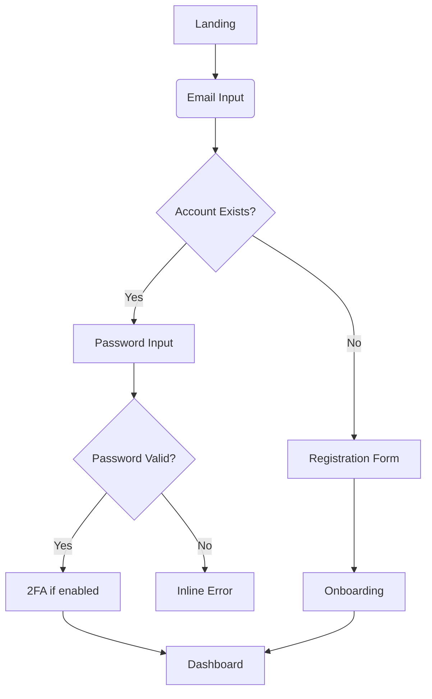

# CloudAuditPro Page Templates

## Overview

This document catalogs the page templates used across CloudAuditPro, analyzing their structure, components, and responsive behavior. It provides recommendations for standardizing page layouts and ensuring consistent user experience.

## Current Page Templates

### Authentication Pages

| Page Type | Components Used | Responsive Behavior | Issues Identified |
|-----------|-----------------|---------------------|-------------------|
| Login | - CloudIcon<br>- Form inputs<br>- Buttons<br>- Error alerts | - Stack layout<br>- Single column<br>- Centered | - No password visibility toggle<br>- Error messages inconsistently positioned<br>- No SSO options |
| Registration | - CloudIcon<br>- Form inputs<br>- Buttons<br>- Error alerts | - Stack layout<br>- Single column<br>- Centered | - No password requirements indicator<br>- No password strength meter<br>- Error recovery not intuitive |

#### Authentication Page Template Update

**Current Issues**
- Password requirements hidden in tooltip 🔴
- No SSO option visibility
- No guided error recovery
- Inconsistent form styling compared to other forms

**Proposed Flow**


**Recommended Template**
```jsx
<AuthLayout>
  <AuthCard>
    <AuthHeader 
      title={isLogin ? "Sign in to your account" : "Create a new account"}
      icon={<CloudIcon className="h-12 w-12 text-primary-600" />}
    />
    
    <AuthForm onSubmit={handleSubmit}>
      {!isLogin && (
        <NameFields />
      )}
      
      <EmailField />
      
      <PasswordField 
        showStrengthMeter={!isLogin}
        showVisibilityToggle
      />
      
      {isLogin && (
        <RememberMeAndForgotPassword />
      )}
      
      <SubmitButton 
        isLoading={isSubmitting}
        text={isLogin ? "Sign in" : "Create account"}
      />
      
      <SSOOptions providers={["google", "microsoft"]} />
    </AuthForm>
    
    <AuthFooter>
      <AuthToggle 
        isLogin={isLogin} 
        onToggle={() => setIsLogin(!isLogin)} 
      />
    </AuthFooter>
  </AuthCard>
</AuthLayout>
```

### Dashboard Templates

| Page Type | Components Used | Responsive Behavior | Issues Identified |
|-----------|-----------------|---------------------|-------------------|
| Main Dashboard | - Sidebar<br>- Header<br>- KPI Cards<br>- Charts<br>- Tables<br>- Actions panel | - Sidebar collapses on mobile<br>- Card grid to stack<br>- Scrollable tables | - Inconsistent grid layout<br>- No skeleton loaders<br>- Overflow issues on mobile |
| Resource Detail | - Breadcrumbs<br>- Resource header<br>- Tabs<br>- Detail panels<br>- Actions sidebar | - Tab to accordion on mobile<br>- Actions move to bottom | - No back button<br>- Inconsistent padding<br>- Tab content overflow issues |
| Settings | - Settings sidebar<br>- Form panels | - Sidebar to top nav on mobile<br>- Stack layout | - Inconsistent form layouts<br>- No save indicators<br>- No form validation |

#### Dashboard Template Update

**Current Issues**
- Layout shifts during loading states 🔴
- Inconsistent card sizes and padding
- Sidebar navigation behavior varies
- No placeholder content for empty states

**Recommended Template**
```jsx
<DashboardLayout>
  <PageHeader 
    title="Dashboard" 
    description="Overview of your cloud resources"
    actions={[
      <Button variant="primary" onClick={handleScan}>Run New Scan</Button>
    ]}
  />
  
  <KPISection>
    <KPICard 
      title="Estimated Savings"
      value={`$${totalSavings}`}
      change={savingsChange}
      icon={<CurrencyDollarIcon />}
      loading={isLoading}
    />
    {/* Additional KPI cards */}
  </KPISection>
  
  <TwoColumnSection>
    <ChartPanel 
      title="Cost Trend"
      loading={isLoading}
      chart={<LineChart data={costData} />}
    />
    
    <TablePanel
      title="Recent Findings"
      loading={isLoading}
      emptyState={<EmptyState icon="search" message="No findings yet" />}
      table={<FindingsTable data={findings} />}
    />
  </TwoColumnSection>
  
  <FullWidthSection>
    <ResourcesPanel 
      title="Cloud Resources"
      resources={resources}
      loading={isLoading}
    />
  </FullWidthSection>
</DashboardLayout>
```

### Audit Views

| Page Type | Components Used | Responsive Behavior | Issues Identified |
|-----------|-----------------|---------------------|-------------------|
| Infrastructure Audit | - Filter panel<br>- Resource table<br>- Detail panel<br>- Action buttons | - Filter panel collapses<br>- Horizontal scroll for table | - Table not optimized for mobile<br>- Filter panel overlaps on mobile<br>- No skeleton loading |
| Cost Optimizer | - Cost breakdown<br>- Recommendations<br>- Action cards | - Card grid to stack<br>- Charts resize | - No fallback for empty data<br>- Inconsistent action buttons<br>- Chart legends overlap |
| Security Audit | - Compliance score<br>- Issue table<br>- Detail panel | - Panel changes to modal on mobile | - Poor error state handling<br>- No compact view for mobile<br>- Table pagination issues |

#### Audit View Template Update

**Current Issues**
- Filters reset when switching between views 🔴
- No ability to save filter presets
- Tables have inconsistent sorting behavior
- Detail panels have varying widths

**Recommended Template**
```jsx
<DashboardLayout>
  <PageHeader 
    title="Infrastructure Audit" 
    description="Audit results for all cloud resources"
    breadcrumbs={[
      { label: "Dashboard", href: "/dashboard" },
      { label: "Infrastructure Audit", href: "/audit/infrastructure" }
    ]}
  />
  
  <FilterPanel 
    filters={activeFilters}
    onChange={handleFilterChange}
    onReset={handleFilterReset}
    onSave={handleSavePreset}
    savedPresets={filterPresets}
  />
  
  <ResourceTable 
    resources={filteredResources}
    loading={isLoading}
    pagination={{
      currentPage,
      totalPages,
      onPageChange: handlePageChange
    }}
    sorting={{
      sortField,
      sortDirection,
      onSortChange: handleSortChange
    }}
    onRowClick={handleRowSelect}
    selectedRow={selectedResource?.id}
  />
  
  <DetailsSidebar 
    isOpen={!!selectedResource}
    onClose={() => setSelectedResource(null)}
    resource={selectedResource}
    actionButtons={[
      <Button variant="primary" onClick={handleOptimize}>Optimize</Button>,
      <Button variant="outline" onClick={handleIgnore}>Ignore</Button>
    ]}
  />
</DashboardLayout>
```

## Page Layout Grid System

CloudAuditPro should adopt a consistent grid system for all pages:

```css
.page-grid {
  display: grid;
  grid-template-columns: repeat(12, 1fr);
  gap: var(--space-4);
}

.col-span-12 { grid-column: span 12; }
.col-span-8 { grid-column: span 8; }
.col-span-6 { grid-column: span 6; }
.col-span-4 { grid-column: span 4; }
.col-span-3 { grid-column: span 3; }

@media (max-width: 768px) {
  .col-span-md-12 { grid-column: span 12; }
  .col-span-md-6 { grid-column: span 6; }
}

@media (max-width: 640px) {
  .col-span-sm-12 { grid-column: span 12; }
}
```

## Responsive Rules

### Breakpoints

All page templates should follow these breakpoint rules:

- **Mobile**: < 640px
- **Tablet**: 640px - 1024px
- **Desktop**: > 1024px

### Layout Transformations

| UI Element | Mobile (<640px) | Tablet (640px-1024px) | Desktop (>1024px) |
|------------|-----------------|------------------------|-------------------|
| Navigation | Bottom navigation | Collapsed sidebar | Expanded sidebar |
| Page header | Simplified | Standard | Standard with actions |
| Data tables | Card view | Scrollable table | Full table |
| Card grids | 1 column | 2 columns | 3-4 columns |
| Filter panels | Bottom drawer | Top collapsible | Side panel |
| Detail panels | Full screen modal | Slide-in panel | Side panel |

## Page Loading States

All page templates should implement consistent loading states:

```jsx
<PageTemplate>
  <PageHeader loading={isLoading} />
  
  <SkeletonLoader 
    visible={isLoading}
    variant="cards"
    count={4}
  />
  
  {!isLoading && (
    <CardGrid>
      {data.map(item => (
        <Card key={item.id} {...item} />
      ))}
    </CardGrid>
  )}
  
  <SkeletonLoader 
    visible={isLoading}
    variant="table"
    rows={5}
    columns={4}
  />
  
  {!isLoading && data.length === 0 && (
    <EmptyState 
      title="No data found"
      description="Try adjusting your filters"
      action={{
        label: "Clear filters",
        onClick: handleClearFilters
      }}
    />
  )}
</PageTemplate>
```

## Empty States

Standard empty states should be implemented for all content areas:

| Content Type | Empty State Content |
|--------------|---------------------|
| Dashboard | "Welcome to CloudAuditPro! Run your first scan to see insights here." |
| Resource list | "No resources found. Try adjusting your filters or run a new scan." |
| Findings | "No findings detected. Your resources are optimally configured." |
| Alerts | "No alerts. You'll be notified when we detect issues." |
| Search results | "No results found for [query]. Try different keywords." |

## Error States

Standard error handling templates for all pages:

```jsx
<PageTemplate>
  {error ? (
    <ErrorState
      title="Error loading data"
      description={error.message}
      actions={[
        {
          label: "Try again",
          onClick: handleRetry,
          primary: true
        },
        {
          label: "Contact support",
          onClick: handleContactSupport,
          primary: false
        }
      ]}
    />
  ) : (
    <PageContent />
  )}
</PageTemplate>
```

## Page Transition Animations

Page transitions should follow these guidelines:

- **Route changes**: Fade transition (300ms)
- **Panel open/close**: Slide transition (250ms)
- **Content updates**: Fade transition (200ms)
- **Loading states**: Pulse animation (1s)

## Page Template Implementation Plan

1. Create base layout components:
   - `AuthLayout`
   - `DashboardLayout`
   - `FullPageLayout`

2. Develop reusable section components:
   - `PageHeader`
   - `ContentSection`
   - `SidePanel`

3. Implement responsive behaviors:
   - Sidebar collapse/expand
   - Table to card transformations
   - Responsive grid layouts

4. Add standardized loading, empty, and error states

5. Apply page transitions and animations 